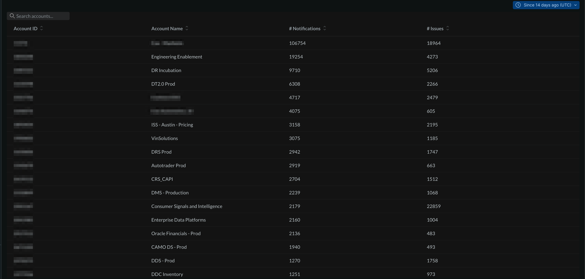
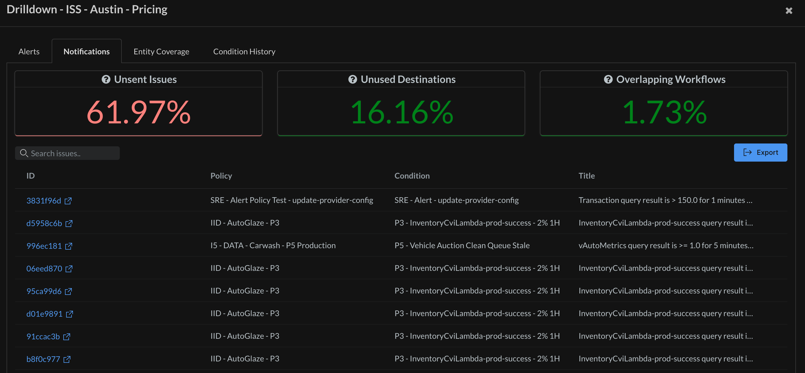
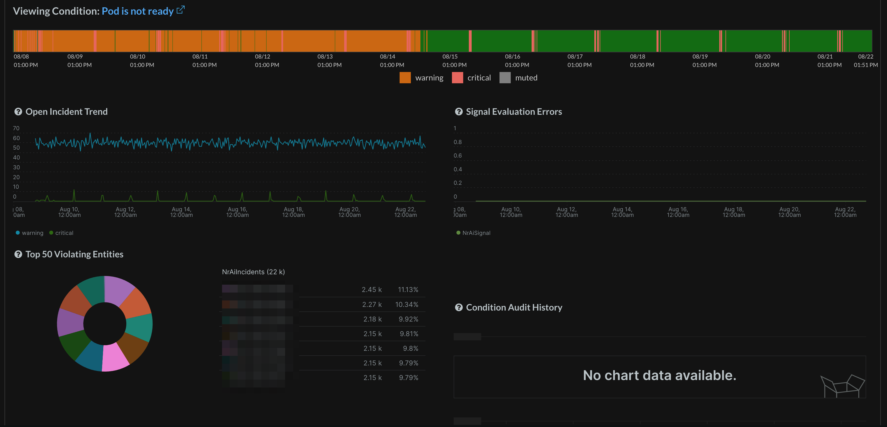

# Alert Quality Management (AQM)

## Usage

This application provides insight into alert hygiene and overall cleanliness of a given New Relic account's alert environment. This includes details around general alert conditions, policies, and notifications with the aim to provide useful details for optimizing and tuning alert artifacts.

## Features
* Aggregated counts of issues and notifications across many accounts
* Drilldown KPIs, including:
   * Short Lived Incidents - Incidents open for 5 min or less
   * Long Running Incidents - Incidents open greater than 1 day
   * Unsent Issues (Noise) - Active issues that did not route to any destinations
   * Unused Destinations - Destinations created but not attached to any Workflows
   * Overlapping Workflows - Workflows with duplicate filters (often the cause of duplicate notifications)
   * Non-Covered Entities - Entities with no conditions targeting them (no alerts).
* Condition History - See the history of incidents that have triggered for a given policy/condition, as well as any recent changes, signal errors, and top offending entities.
* Exportable reports

## Screenshots

## Dependencies

[New Relic Alerts](https://docs.newrelic.com/docs/alerts/overview/) configured.

## Enabling this App

This App is available via the New Relic Catalog.

To enable it in your account:
1. go to `Integrations & Agents > Apps and Visualizations` and search for "Alert Quality Management"
2. Click the `Alert Quality Management` card, and then click the `Add this App` button to add it to your account(s)
3. Click `Open App` to launch the app (note: on the first time accessing the app, you may be prompted to enable it)

Once you have added your accounts, you can also open the app by:
1. Open the `Apps` left-hand navigation menu item (you may need to click on the `Add More` ellipsis if it doesn't show up by default)
2. In the `Your Apps` section, locate and click on the `Alert Quality Management` card to open the app

#### Manual Deployment
If you need to customize the app, fork the codebase and follow the instructions on how to [Customize a Nerdpack](https://docs.newrelic.com/docs/new-relic-solutions/tutorials/customize-nerdpacks/). If you have a change you feel everyone can benefit from, please submit a PR!

## Support

This project is actively maintained by the New Relic Labs team. Connect with us directly by [creating issues](../../issues) or [asking questions in the discussions section](../../discussions) of this repo.

We also encourage you to bring your experiences and questions to the [Explorers Hub](https://discuss.newrelic.com) where our community members collaborate on solutions and new ideas.

New Relic has open-sourced this project, which is provided AS-IS WITHOUT WARRANTY OR DEDICATED SUPPORT.

## Security

As noted in our [security policy](https://github.com/newrelic/nr-labs-pages/security/policy), New Relic is committed to the privacy and security of our customers and their data. We believe that providing coordinated disclosure by security researchers and engaging with the security community are important means to achieve our security goals.

If you believe you have found a security vulnerability in this project or any of New Relic's products or websites, we welcome and greatly appreciate you reporting it to New Relic through [HackerOne](https://hackerone.com/newrelic).

## Contributing

Contributions are welcome (and if you submit a Enhancement Request, expect to be invited to contribute it yourself :grin:). Please review our [Contributors Guide](CONTRIBUTING.md).

Keep in mind that when you submit your pull request, you'll need to sign the CLA via the click-through using CLA-Assistant. If you'd like to execute our corporate CLA, or if you have any questions, please drop us an email at opensource@newrelic.com.

## Open Source License

This project is distributed under the [Apache 2 license](LICENSE).
