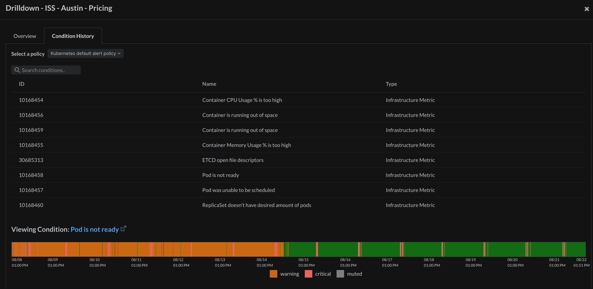

[](https://opensource.newrelic.com/oss-category/#new-relic-experimental)

# Alert Quality Management (AQM)

## Usage

This application provides insight into alert hygiene and overall cleanliness of a given New Relic account's alert environment. This includes details around general alert conditions, policies, and notifications with the aim to provide useful details for optimizing and tuning alert artifacts.

## Features
* Aggregated counts of issues and notifications across many accounts
* Drilldown KPIs, including:
   * Flapping incidents - Incidents open for 5 min or less
   * Long Running incidents - Incidents open greater than 1 day
   * Unsent Issues (Noise) - Active issues that did not route to any destinations
   * Unused Destinations - Destinations created but not attached to any Workflows
   * Overlapping Workflows - Workflows with duplicate filters (often the cause of duplicate notifications)
* Condition History - See the history of incidents that have triggered for a given policy/condition, as well as any recent changes, signal errors, and top offending entities.


## Screenshots





## Getting Started
First, ensure that you have [Git](https://git-scm.com/book/en/v2/Getting-Started-Installing-Git) and [NPM](https://www.npmjs.com/get-npm) installed. If you're unsure whether you have one or both of them installed, run the following command(s) (If you have them installed these commands will return a version number, if not, the commands won't be recognized):

```bash
git --version
npm -v
```

Next, install the [NR1 CLI](https://one.newrelic.com/launcher/developer-center.launcher) by going to [this link](https://one.newrelic.com/launcher/developer-center.launcher) and following the instructions (5 minutes or less) to install and setup your New Relic development environment.


```bash
git clone git@github.com:newrelic-experimental/nr1-aqm.git
cd nr1-aqm
npm install
nr1 nerdpack:uuid -gf [--profile=<PROFILE>]
nr1 nerdpack:serve [--profile=<PROFILE>]
```

**Pro Tip: run `nr1 profiles:list` to see what profiles (accounts) are available to serve to.**

Visit [https://one.newrelic.com/?nerdpacks=local](https://one.newrelic.com/?nerdpacks=local), navigate to the Nerdpack, and :sparkles:

## Deploying this Nerdpack

Open a command prompt in the nerdpack's directory and run the following commands.

```bash
# To create a new uuid for the nerdpack so that you can deploy it to your account:
# nr1 nerdpack:uuid -g [--profile=your_profile_name]

# To see a list of API keys / profiles available in your development environment:
# nr1 profiles:list

nr1 nerdpack:publish [--profile=your_profile_name]
nr1 nerdpack:deploy [-c [DEV|BETA|STABLE]] [--profile=your_profile_name]
nr1 nerdpack:subscribe [-c [DEV|BETA|STABLE]] [--profile=your_profile_name]
```

Visit [https://one.newrelic.com](https://one.newrelic.com), navigate to the Nerdpack, and :sparkles:

## Issues / Enhancement Requests

Issues and enhancement requests can be submitted in the [Issues tab of this repository](https://github.com/newrelic-experimental/nr1-aqm/issues). Please search for and review the existing open issues before submitting a new issue.

## Contributing

We encourage your contributions to improve nr1-aqm! Keep in mind when you submit your pull request, you'll need to sign the CLA via the click-through using CLA-Assistant. You only have to sign the CLA one time per project.
If you have any questions, or to execute our corporate CLA, required if your contribution is on behalf of a company,  please drop us an email at opensource@newrelic.com.

**A note about vulnerabilities**

As noted in our [security policy](../../security/policy), New Relic is committed to the privacy and security of our customers and their data. We believe that providing coordinated disclosure by security researchers and engaging with the security community are important means to achieve our security goals.

If you believe you have found a security vulnerability in this project or any of New Relic's products or websites, we welcome and greatly appreciate you reporting it to New Relic through [HackerOne](https://hackerone.com/newrelic).

## License
nr1-aqm is licensed under the [Apache 2.0](http://apache.org/licenses/LICENSE-2.0.txt) License.
